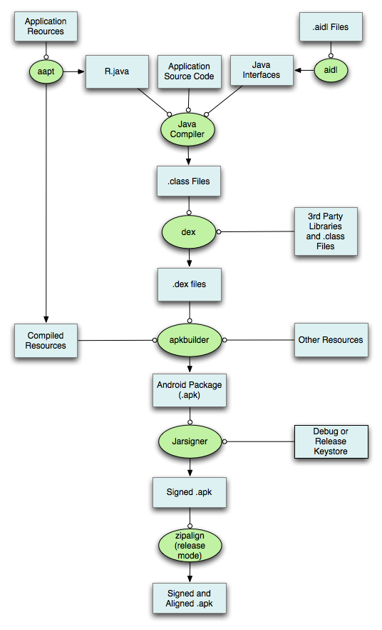
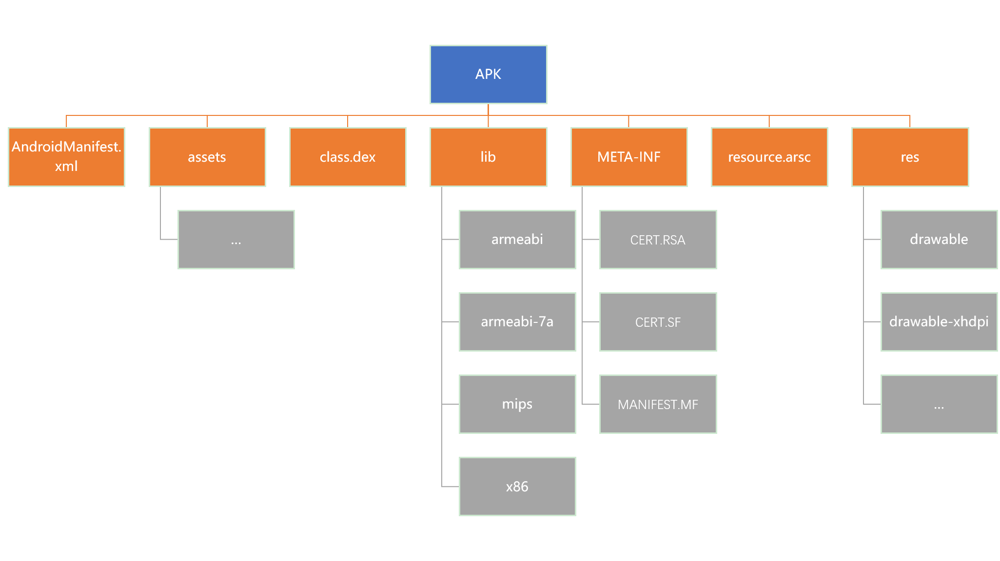

# Android 基础

# 基础知识

依次阅读以下书籍，由浅入深地了解基本的Android开发知识

- 第一行代码，阅读完前七章即可。
- Android 编程权威指南（可选）
- Android 高级进阶（可选）

一般应需要了解Android开发中如下知识

- Android系统架构
- 基本源文件架构
- 基本语言了解
- 了解一些基本代码的含义

# Apk 打包流程

当我们编写玩我们的App的程序时，我们的最后一步就是就App中所有使用到的资源文件进行打包。其打包流程如下图（http://androidsrc.net/android-app-build-overview/）所示：

具体的操作如下

1. 使用aapt(The Android Asset Packing Tool) 对资源文件进行打包，生成R.java文件。
2. 如果项目中使用到了AIDL（AndroidInterface Definition Language）提供的服务，则需要使用AIDL工具解析AIDL接口文件生成相应的Java代码。
3. 使用javac将R.java和AIDL文件编译为.class文件。
4. 使用dx工具将class和第三方的library转换为dex文件。
5. 利用apkbuilder将第一步编译后的资源、第四步生成的.dex文件，以及一些其它资源打包到APK文件中。
6. 这一部主要是对APK进行签名。可以分为两种情况，如果我们是要发布App，那就采用RealeaseKeystore 签名；反之，我们如果只是想要对App进行调试，那就使用debug.keystore签名。
7. 在发布正式版之前，我们需要将APK包中资源文件距离文件的起始偏移修改为4字节的整数倍数，这样，在之后运行App的时候，速度会比较快。

# Apk 文件结构

APK文件也是一种ZIP文件。因此，我们可以使用解压zip的工具来对其进行解压。一个典型的APK文件的结构如下图所示。其中，关于每一部分的介绍如下

- AndroidManifest.xml
  - 该文件主要用于声明应用程序的名称，组件，权限等基本信息。
- class.dex
  - 该文件是dalvik虚拟机对应的可执行文件，包含应用程序的可执行代码。
- resource.arsc
  - 该文件主要是应用程序编译后的二进制资源以及资源位置与资源id之间的映射关系，如字符串。
- assets
  - 该文件夹一般用于包含应用程序的原始资源文件，例如字体和音乐文件。程序在运行的时候，可以通过API获取这些信息。
- lib/
  - lib目录下主要用于存储通过JNI（Java Native Interface）机制使用的本地库文件，并且会按照其支持的架构，分别创建对应的子目录。
- res/
  - 该目录主要包含了Android应用引用的资源，并且会按照资源类型进行存储，如图片，动画，菜单等。主要还有一个value文件夹，包含了各类属性资源
    - colors.xml-->颜色资源
    - dimens.xml--->尺寸资源
    - strings--->字符串资源
    - styles.xml-->样式资源
- META-INF/
  - 类似于JAR文件，APK文件中也包含了META-INF目录，用于存放代码签名等文件，以便于用来确保APK文件不会被人随意修改。