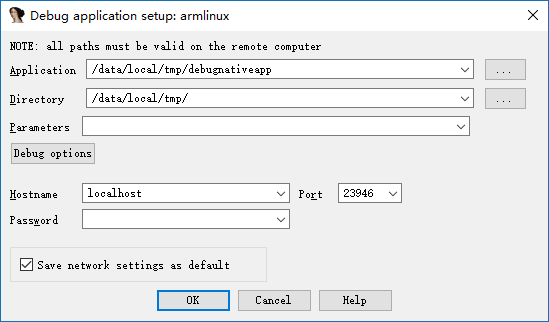
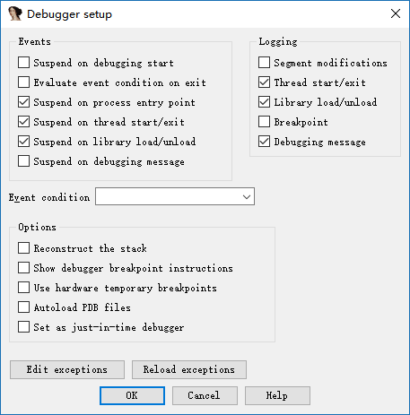
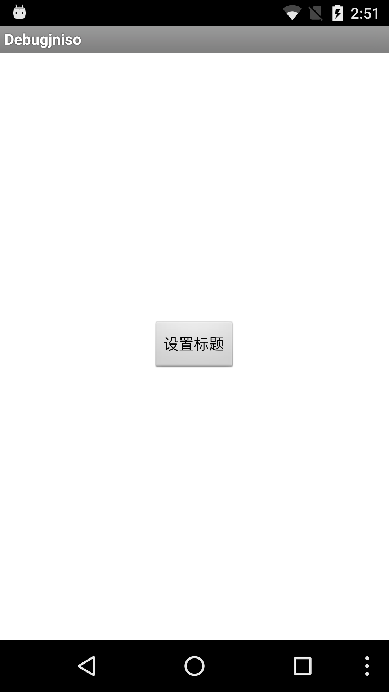

# Android 动态调试原生层程序

这里我们会介绍如何调试以下种类的程序

- 基本的原生层程序，即简单的c/c++程序。
- 原生so程序

# 必备工具

必备工具

- **已经root的可调试手机**
- IDA

# 基本环境搭建

无论是调试什么原生层程序，基本的环境搭建都是类似的，需要确保IDA与手机通信正常。

1. 上传android_server文件(在ida的dbgsrv文件夹下)，并修改相应权限使其可以执行

```shell
adb push android_server /data/local/tmp/
adb shell chmod 755 /data/local/tmp/android_server
```

2. 开启android_server，其会监听23946端口(以root权限运行)

```shell
adb shell # 进入adb
su # 切换root
./data/local/tmp/android_server #启动android_server
```
3. 建立本地计算机23496端口与手机端口23946的通信。当PC有客户端连接23946端口时，其发送的信息都将被转发到手机的相应的端口，这时android_server就收到相应的数据，从而使得IDA可以调试程序。前面的tcp的端口指的是本地PC的端口，后面的指的是手机的端口。

```shell
adb forward tcp:23946 tcp:23946
```
注意：

> 其实这个连接建立的是adb server与与手机上adbd之间的通信。所以其通信大概是这个样子的
>
> IDA<-->adb server<--->adbd<---->android_server
>
> ​         电脑                   |             手机

**其中，第一步只需要执行一次，后面就不需要再次执行。而第2-3步每次都得执行，因此可以写成一个脚本，并将脚本的路径放在系统的path环境变量下，这样我们可以执行一个命令直接执行。**

# 基本原生程序调试

基本的原生程序指的是普通的编译为arm汇编的c/c++程序。

## 添加程序

首先，我们需要把原生程序放到android设备中，并修改其权限，使其可以被执行。如下

```shell
adb push debugnativeapp /data/local/tmp/
adb shell chmod 755 /data/local/tmp/debugnativeapp
```

## 启动调试

根据原生层程序的位数选择相应的ida，然后选择Debugger-Run-RemoteArmLinux/Android debugger，如下界面

 

其中，重要的参数意义如下

- Application
  - 被调试程序在手机上的绝对路径。
- Directory
  - 被调试程序在手机中的目录
- Hostname
  - 即我们与哪个主机进行通信，这里我们直接和本地PC进行通信。

其中Debug options选择如下

 

主要是选择了三个Events，使得我们的程序可以在入口点，线程启动时，library加载时自动停止。当然，也可以都进行选择。

启动程序后，如下

 

注：

> 1. 如果发现can not load plugin ，那可能是手机没有root。
>
> 2. 如果遇到以下问题，直接cancel就好。具体原因还不清楚。
>
>    
>
> 3. 如果遇到error: only position independent executables (PIE) are supported.一般是因为android手机的版本大于5，可以尝试
>
>    - 使用android_server的PIE版本
>    - 利用010Editor将可执行ELF文件的header中的elf header字段中的e_type改为ET_DYN(3)。

# so原生程序调试

对于so原生程序，我们可能会想这和普通原生程序有什么不一样的地方呢？自然是有的，so文件不能单独运行。一般是其它程序调用so文件中的基本某些函数。所以这里我们就不能直接采用上面run的方式了。一般来说，android中so文件都是依赖于apk文件的。

这里

## 安装程序

首先，我们需要将apk安装到手机上。

```shell
adb install debugjniso.apk
```

## 调试模式启动app

其次，我们需要以**调试模式启动程序**，这样，才可以方便IDA来捕捉到相应的程序并对其进行attach。

 ```shell
adb shell am start -D -n packagename/.MainActivity
 ```

## attach程序

启动IDA pro，点击Debugger-Attach-RemoteArmLinux/Android debugger，Hostname填localhost，port默认就是23946端口。其实就是我们本地电脑的监听端口。如下

 

点击ok，启动调试

**注意：**

> 如果最后出现只有一个程序/bin/sh可以被attach，那说明没有以root权限运行android_server程序。

利用ctrl+f快速定位并选择相应的进程，如下

 

然后ok确定即可。

这时我们可以看到我们已经attach成功了。

 

这时候我们再点击Debugger-Debugger options，设置相关选项如下



意思类同于原生程序。

> 为什么这时候才选择要设下相应的断点，是因为如果在开始attach的时候就设置的话，到这里其实是没有的。大家可以试试。

## 恢复app执行

这时候，app的界面是wait for debugger，我们也已经attach上去了。这时候，就需要让程序继续运行了。

首先，我们打开ddms来选中我们要调试的进程。


这里其实相当于直接执行了

```shell
# 显示手机所有可供调试的用户进程
adb jdwp
# 在PC的xxx端口与手机的相应端口之间建立连接，方便通信
adb forward tcp:xxx jdwp:<pid>
```

之所以不适用命令去执行，是因为我们还得自己去确定我们的apk的进程号，这会比较麻烦。

这里给出一个基本的通信过程


此时，我们的电脑已经与手机的app虚拟机之间建立了通信。同时，我们需要使用jdb在java层来将我们的apk应用attach到我们的电脑上，这里我们使用如下的命令。

```shell
jdb -connect com.sun.jdi.SocketAttach:hostname=localhost,port=xxx
```

其中xxx就是我们在ddms看到的8700端口，一般默认就是这个。执行之后

```shell
C:\Users\iromise
λ jdb.bat

jdb -connect com.sun.jdi.SocketAttach:hostname=127.0.0.1,port=8700
设置未捕获的java.lang.Throwable
设置延迟的未捕获的java.lang.Throwable
正在初始化jdb...
>
```

我们再次看一下我们的手机，

 

此时，应用已经又继续运行了，不再是之前的wait for debugger了。

## 确定原生函数地址

这里我们再次打开一个ida，导入该apk的so库，然后在export中寻找我们的函数，如下

 

可以看出其偏移为0xc38。

我们再在之前的调试的IDA中运行F9直到怎么按都不再运行，我们会看到程序断在linker处

 

此时，我们**点击app界面的设置标题按钮**（之所以要按这个，是因为在该函数中调用了原生API），再次观察IDA，可以看出该so库已经被加载进入

```text
B3B05000: loaded /data/app/com.droider.debugjniso-1/oat/arm/base.odex
B39B9000: loaded /system/lib/hw/gralloc.msm8974.so
B39B2000: loaded /system/lib/libmemalloc.so
B39AA000: loaded /system/lib/libqdutils.so
B3B00000: loaded /data/app/com.droider.debugjniso-1/lib/arm/libdebugjniso.so
```

这时，我们利用ctrl+s定位到该库的起始地址处0xB3B00000。然后根据

```text
绝对地址=基地址+相对偏移
```

得到jnistring的地址。

## 观察结果

按下g，然后输入 `+0xC38` ，点击ok即可跳转至该函数

```assembly
libdebugjniso.so:B3B00C38 Java_com_droider_debugjniso_TestJniMethods_jniString
libdebugjniso.so:B3B00C38 LDR             R1, =(unk_B3B02148 - 0xB3B00C4C)
libdebugjniso.so:B3B00C3C STMFD           SP!, {R4,LR}
libdebugjniso.so:B3B00C40 LDR             R3, [R0]
libdebugjniso.so:B3B00C44 ADD             R1, PC, R1 ; unk_B3B02148
libdebugjniso.so:B3B00C48 MOV             LR, PC
```

我们在此函数的开始处F2下断点，然后再次F9执行程序，同时观看手机，就可以发现app的标题变成了`你好！Nativemethod` 。

到此，so原生程序的基本调试步骤就结束了。

注：

> 如果中间出现了add map的对话框直接点击Cancel，然后apply即可。

参考阅读

- http://www.52pojie.cn/thread-554068-1-1.html